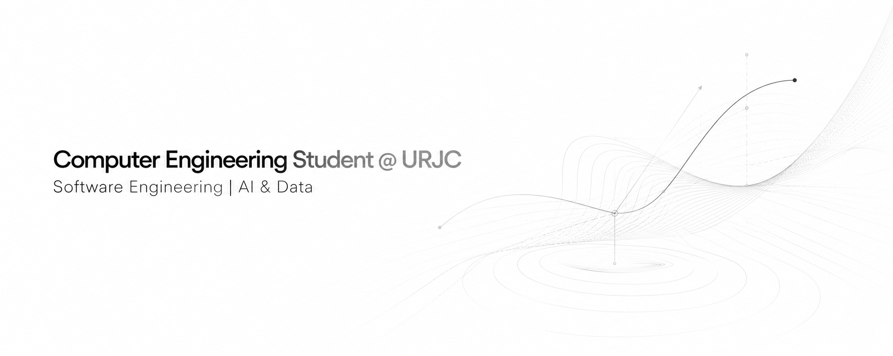

  

# Alejandro Cuntin Bariteau

Computer Engineering Student @ URJC

Building software systems, exploring AI, and developing secure technology for the future.

**Software Engineering • Artificial Intelligence • Cybersecurity**

Madrid, Spain

---

## About Me

I'm a Computer Engineering student passionate about building software systems that solve real-world problems.

My experience ranges from enterprise management platforms and healthcare systems to blockchain applications and embedded robotics projects.

Currently, I am focused on strengthening my foundations in Software Engineering while expanding my knowledge in Artificial Intelligence, Data Science and Cybersecurity.

Expected Graduation: **2028**

---

## Technical Skills

### Programming Languages

### Software Engineering

- Spring Boot
- REST APIs
- Hibernate
- JPA
- Object-Oriented Programming (OOP)
- Software Architecture
- Data Structures & Algorithms

### Technologies

- Git & GitHub
- Linux
- Arduino
- Maven
- H2 Database
- Smart Contracts
- ERC-20 Tokens

### Areas of Interest

- Artificial Intelligence
- Machine Learning
- Cybersecurity
- Data Science
- Backend Engineering
- Blockchain
- Distributed Systems

---

## Languages

| Language | Level |
|-----------|---------|
| 🇪🇸 Spanish | Native |
| 🇫🇷 French | Native |
| 🇬🇧 English | Advanced |
| 🇮🇹 Italian | Basic |

---

## Featured Projects

### UltraFit

Fitness management platform built with Spring Boot.

**Highlights**
- Authentication system
- Reservation management
- Membership plans
- REST API architecture
- Persistent database storage

🔗 Repository:
https://github.com/AlejandroCuntin/fitness-booking-website

---

### Decentralized Library

Blockchain-based library management platform powered by Solidity Smart Contracts and ERC-20 utility tokens.

**Highlights**
- Custom ERC-20 token
- Lending and penalty system
- Smart contract architecture
- Decentralized business logic

🔗 Repository:
https://github.com/AlejandroCuntin/library-smart-contracts-erc20-token

---

### MiSanidad

Healthcare management system built with Java Swing and Object-Oriented Programming principles.

**Highlights**
- Multi-role architecture
- Medical records management
- Appointment scheduling
- Data persistence
- CSV report generation

🔗 Repository:
https://github.com/AlejandroCuntin/healthcare-management-system

---

### Arduino Robotic Arm

Embedded systems project featuring a 3-DOF robotic arm controlled through servos, stepper motors and rotary encoders.

**Highlights**
- Hardware interrupts
- Real-time control
- Embedded programming
- Robotics fundamentals

---

## Currently Learning

- Machine Learning
- Data Science
- Cybersecurity
- AI Systems
- Advanced Software Architecture

---

## GitHub Statistics

  
  

---

## Connect With Me

LinkedIn  
https://www.linkedin.com/in/alejandro-cuntin-bariteau-339651360/

Email  
Alejandrobariteau@gmail.com

GitHub  
https://github.com/AlejandroCuntin

---

> “Great software is built through engineering discipline, continuous learning and curiosity.”
